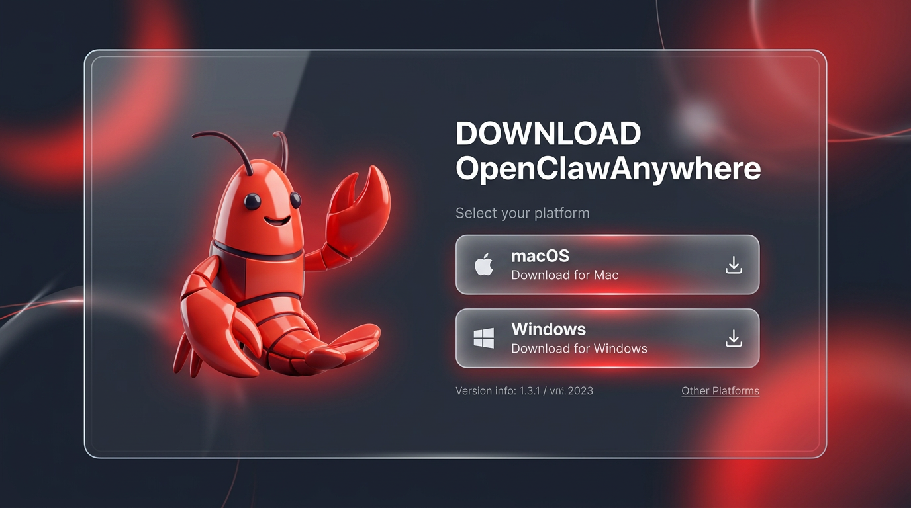

# 🐾 OpenClawAnywhere

<p align="center">
  
</p>

<p align="center">
  <strong>Your Mac/PC, Your Pocket AI Agent.</strong>
</p>

<p align="center">
  让每一台运行 OpenClaw 的本地电脑，通过扫码瞬间变为「随时随地可控」的私有化 AI 服务器。
</p>

<p align="center">
  手机扫码 → 连接家里的电脑 → 开始对话。无需注册、无需下载 App、数据全部留在本地。
</p>

---

## ✨ 核心特性

- 🔗 **一键穿透** — 自动下载 Cloudflare Tunnel，3 秒内获得公网 HTTPS 地址
- 📱 **扫码直连** — 终端打印二维码，手机扫一下就进入 Web 控制台
- 🔒 **Token 鉴权** — 每次启动生成唯一 Token，防止未授权访问
- 💬 **流式对话** — 支持 `<think>` 思考流分离渲染 + Markdown 实时输出
- 🖥️ **跨平台** — Windows / macOS / Linux 全支持
- 🏠 **隐私至上** — 所有数据留在你的电脑，不经过任何中继服务器

---

## 🚀 快速开始

两种使用方式，选适合你的：

| | 桌面版 | 命令行版 |
|---|---|---|
| 需要 Node.js | ❌ 不需要 | ✅ 需要 v18+ |
| cloudflared | 内置 | 首次运行自动下载 |
| 开机自启 | 有开关 | 需自行配置 |
| 适合 | 普通用户 | 开发者 |

---

## 🖥️ 桌面版（推荐，零门槛）

```bash
# 默认启动（python main.py）
npm start

# 自定义 Agent 命令
# Windows:
set AGENT_CMD=python
set AGENT_ARGS=main.py
set AGENT_CWD=C:\path\to\openclaw
npm start

# macOS / Linux:
AGENT_CMD=python AGENT_ARGS=main.py AGENT_CWD=/path/to/openclaw npm start
```

启动后终端会打印：

```
[Gateway] 服务已启动，监听 0.0.0.0:18789
[TunnelManager] ✅ 隧道已就绪：https://xxx-yyy.trycloudflare.com

  请用手机扫描下方二维码连接：

  ▄▄▄▄▄▄▄
  █ QR  █
  ▀▀▀▀▀▀▀
```

掏出手机扫码，搞定。

---

## 🖥️ 桌面版（推荐，零门槛）

不想用命令行？下载安装包，双击即用。内置 cloudflared，无需安装 Node.js。

### 📥 下载安装包

前往 [GitHub Releases](https://github.com/cy0007/openclawanywhere/releases/latest) 下载对应平台的安装包：

<p align="center">
  
</p>

| 平台 | 文件 | 说明 |
|------|------|------|
| macOS (Apple Silicon) | `OpenClawAnywhere_x.x.x_aarch64.dmg` | M1/M2/M3/M4 芯片 |
| macOS (Intel) | `OpenClawAnywhere_x.x.x_x64.dmg` | 2020 年前的 Mac |
| Windows | `OpenClawAnywhere_x.x.x_x64-setup.exe` | 64 位 Windows 10+ |
| Linux | `OpenClawAnywhere_x.x.x_amd64.deb` / `.AppImage` | Ubuntu / 通用 |

安装后启动 App → 系统托盘出现 🐾 图标 → 终端弹出二维码 → 手机扫码连接。

### 桌面版特性

- 系统托盘静默运行
- 开机自启开关（设置面板内）
- cloudflared 内置，无需额外下载

### 从源码构建

```bash
# 前提：安装 Rust (https://rustup.rs)
npm install
npm run release
```

构建产物在 `src-tauri/target/release/bundle/` 下。

---

## 🚀 命令行启动（开发者）

前提：[Node.js](https://nodejs.org/) v18+ 已安装。

```bash
git clone https://github.com/cy0007/openclawanywhere.git
cd openclawanywhere
npm install
```

## 📁 项目结构

```
openclawanywhere/
├── src/
│   ├── tunnelManager.js   # Cloudflare Tunnel 下载 & 管理
│   ├── gateway.js         # Express + Socket.io 网关 & Token 鉴权
│   └── agentRunner.js     # OpenClaw Agent 子进程管理
├── public/
│   ├── index.html         # 移动端 Web 控制台
│   └── desktop.html       # 桌面端状态面板
├── src-tauri/             # Tauri 桌面壳 (Rust)
│   ├── src/main.rs        # 托盘 + 自启 + Sidecar
│   └── tauri.conf.json    # 打包配置
├── scripts/
│   └── build-sidecar.sh   # Node.js → 单文件二进制打包脚本
├── run.js                 # 程序入口
└── docs/                  # 产品 & 技术文档
```

---

## ⚙️ 环境变量

| 变量 | 说明 | 默认值 |
|------|------|--------|
| `AGENT_CMD` | Agent 启动命令 | `python` |
| `AGENT_ARGS` | Agent 命令参数 | `main.py` |
| `AGENT_CWD` | Agent 工作目录 | 项目根目录 |

---

## 🔧 工作原理

```
手机浏览器 ──HTTPS/WSS──▶ Cloudflare Tunnel ──本地映射──▶ Node.js Gateway (18789)
                                                              │
                                                    ┌─────────┴─────────┐
                                                    │  Socket.io 鉴权   │
                                                    │  Token 校验       │
                                                    └─────────┬─────────┘
                                                              │
                                                     OpenClaw Agent (stdin/stdout)
```

1. 启动时自动下载平台对应的 `cloudflared` 二进制
2. 拉起 Quick Tunnel，获得临时公网 HTTPS 地址
3. 生成一次性 Token，拼接成鉴权 URL 并打印二维码
4. 手机扫码 → 加载 Web 控制台 → WebSocket 握手（携带 Token）
5. 用户输入 → stdin 写入 Agent → stdout 流式输出 → WebSocket 推送到手机

---

## 📋 技术栈

- **后端**: Node.js + Express + Socket.io + execa
- **穿透**: Cloudflare Tunnel (Quick Tunnel mode)
- **前端**: HTML5 + TailwindCSS (CDN) + marked.js + Socket.io Client
- **桌面**: Tauri 2 (Rust) + tauri-plugin-autostart + tauri-plugin-shell
- **打包**: @yao-pkg/pkg (Node.js → 单文件二进制)

---

## 🛡️ 安全说明

- 每次启动生成全新的 `nanoid` Token，一次性有效
- WebSocket 握手强制校验 Token，未授权连接立即拒绝
- 所有公网流量通过 Cloudflare HTTPS 加密
- 零数据上传 — 聊天记录、配置文件全部保留在用户本地

---

## 📄 License

MIT

---

> *Built with ❤️ for AI enthusiasts who want their local AI, anywhere.*