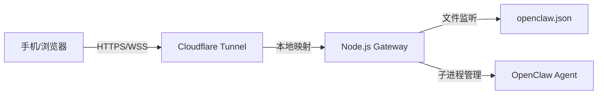

---

# OpenClawAnywhere 技术架构文档 (System Design)

## 1. 系统架构全景图 (High-Level Architecture)
系统由 **Host Service (宿主服务)** 和 **Web Client (移动端控制台)** 组成，通过 **WSS (WebSocket Secure)** 通信。



## 2. 核心模块技术方案

### 2.1 网关服务 (Gateway Module)
*   **运行时**：Node. Js v 18+ (跨平台兼容性最好)。
*   **路由引擎**：Express. Js。负责提供静态页面和 Health Check 接口。
*   **WebSocket 协议**：Socket. Io (内置心跳检测与断线重连逻辑)。
*   **进程守护**：`execa`。用于拉起 Cloudflared 和监控 Agent 的 Stdout 流。

### 2.2 穿透协议 (Tunneling Module)
*   **实现逻辑**：启动时检测本地 `bin/` 目录。若不存在，根据 `process.platform` 和 `process.arch` 从官方镜像下载对应的二进制文件。
*   **安全防御**：所有隧道连接均强制要求 `handshake` 阶段提供 `token`。

### 2.3 状态同步 (State Sync Module)
*   **热更新策略**：采用“读写分离”机制。App 端修改配置 -> 发送 WebSocket 指令 -> Gateway 更新 JSON 文件 -> Gateway 触发 `fs.watch` 事件 -> 通知 Agent 重启模块。

---

## 3. 目录结构设计 (Project Scaffolding)
遵循工业级 Node. Js 项目规范：

```text
/openclaw-anywhere
├── /bin              # 存放 cloudflared 可执行文件
├── /public           # 移动端 Web 控制台源码
│   ├── index.html    # 核心 UI
│   ├── /js           # 逻辑脚本
│   └── /css          # 样式表
├── /src              # 后端核心逻辑
│   ├── gateway.js    # Socket.io 服务器
│   ├── tunnel.js     # 穿透封装逻辑
│   ├── config.js     # 文件监视与热重载
│   └── logger.js     # 日志处理流
├── package.json      # 依赖管理
└── run.sh / run.bat  # 一键启动入口
```

## 4. 开发规划与里程碑 (Roadmap)

| 阶段 | 核心目标 | 交付物 |
| :--- | :--- | :--- |
| **M 1: 骨架搭建** | 实现本地 HTTP 穿透与 Web 页面访问 | 网页能成功加载 |
| **M 2: 通信握手** | 实现 Token 鉴权与 Socket 双向连接 | 连接成功，绿色呼吸灯亮起 |
| **M 3: 数据流转换** | 实现流式 Token 接收与思考区解析 | 思考流能够实时打字显示 |
| **M 4: 指令闭环** | 实现配置文件的远程读写 | 模型参数修改生效 |
| **M 5: 发布封装** | 制作跨平台安装包 | `.exe` / `.dmg` 下载包 |

---

## 5. 开发原则与标准 (Development Standards)

1.  **无状态设计 (Stateless)**：后端网关不存储任何用户数据。所有状态（聊天记录、配置）要么存在本地 JSON 文件，要么存在用户手机浏览器的 `LocalStorage` 中。
2.  **错误隔离**：Tunnel 崩溃不能导致 Gateway 崩溃；Gateway 崩溃不能导致 Agent 停止运行。
3.  **安全性**：
    *   **生产环境**：强制通过 HTTPS 访问（Cloudflare 提供）。
    *   **开发环境**：本地回环地址（127.0.0.1）不强求 HTTPS。

---

